  

  

 

<table>
<tr>
<td align="center" width="25%"><h2>9.31</h2>CGPA · ENTC @ PICT Pune</td>
<td align="center" width="25%"><h2>4×</h2>Hackathon podiums</td>
<td align="center" width="25%"><h2>1</h2>Published research paper</td>
<td align="center" width="25%"><h2>600+</h2>Teams outranked at VOIS 2.0</td>
</tr>
</table>

- **Who:** Third-year Electronics & Telecommunication student at PICT, Pune, and **Software Engineer Intern at MindstriX Technologies**, working on LLM integration, API development and AI R&D.
- **What I build:** Systems at the intersection of **Computer Vision, Embedded Systems and Intelligent Automation**: production Gemini Vision pipelines, a YOLOv8 + dual-ESP32 pothole-detection rig, density-aware traffic signals, and an AI governance layer for agricultural insurance claims.
- **Recognition:** Our agri-governance platform was presented to and recognised by the **Maharashtra CM, Agriculture Minister and Higher & Technical Education Minister**.
- **Currently building:** AI-native Android systems that combine the Gemini API with real-world sensor data.

> *I learn engineering by building, breaking, debugging and shipping real systems, not just by studying theory.*

 

 

| | Competition | Scope | Domain |
|:---:|:---|:---:|:---:|
| **1st Place** | **TechFiesta '26** | International | Agriculture |
| **1st Place** | **HackVenture 2K26** | National | Agritech |
| **Runner-Up** | **Pune Agri International Hackathon** | International | Agri-Governance |
| **Top 3 / 600+** | **VOIS Innovation Marathon 2.0** (Vodafone Idea Foundation) | National | Open Innovation |
| **Published** | **[IPDS: Real-Time Pothole Detection](https://zenodo.org/records/20760578)** (DOI 10.5281/zenodo.20760578) | Research | Computer Vision · IoT |

 

 

<table>
<tr>
<td align="right" width="190"><b>AI &amp; Machine Learning</b></td>
<td></td>
</tr>
<tr>
<td align="right"><b>Backend &amp; Databases</b></td>
<td></td>
</tr>
<tr>
<td align="right"><b>Cloud &amp; DevOps</b></td>
<td></td>
</tr>
<tr>
<td align="right"><b>Mobile &amp; Embedded</b></td>
<td></td>
</tr>
<tr>
<td align="right"><b>Frontend &amp; Languages</b></td>
<td></td>
</tr>
</table>

 

 

  

  

<table>
<tr>
<td width="55%" valign="middle">

Click to watch the full walkthrough

</td>
<td width="45%" valign="top">

**The problem.** Banking trojans like *Hydra, Anubis, Xenomorph, SOVA* and *Octo* clone real banking apps, abuse Accessibility to read the screen, overlay fake logins and swallow OTPs. A fresh build scores **0/70 on VirusTotal**.

**What Sudarshan does:**
- Repairs and decompiles deliberately malformed APKs
- Detonates them in a **Frida-instrumented sandbox**
- Intercepts live **C2 traffic** via mitmproxy
- Maps behaviour to **MITRE ATT&CK**
- Produces a **deterministic, auditable 0–100 risk score**
- A Gemini RAG analyst that *explains* the verdict but can never change it

</td>
</tr>
</table>

<table>
<tr>
<td width="33%" align="center"> <b>Upload &amp; 6-stage pipeline</b></td>
<td width="33%" align="center"> <b>Threat intel: Hydra match, 82% confidence</b></td>
<td width="33%" align="center"> <b>Evidence-grounded AI analyst</b></td>
</tr>
</table>

<b>Architecture &amp; engineering breakdown</b> (click to expand)

 

| Component | Technical implementation |
|:---|:---|
| **Decompile &amp; Repair** | Androguard, APKTool and JADX. Automated anti-analysis repair detects and fixes deliberately malformed ZIP and `AndroidManifest` headers built to crash standard reverse-engineering tools. |
| **Dynamic Frida Sandbox** | Detonates samples in an isolated Android runtime with live Frida hooks on Accessibility Services, overlay APIs (`SYSTEM_ALERT_WINDOW`) and SMS receivers. An autonomous UI-exploration agent clicks through prompts and defeats anti-emulation sleep evasion. |
| **C2 Extraction &amp; Attribution** | A `mitmproxy` sidecar captures live C2 domains, IPs and beacons, cross-referenced against AlienVault OTX, AbuseIPDB and VirusTotal, then mapped to MITRE ATT&amp;CK techniques. |
| **Deterministic Scoring** | The Banking Fraud &amp; Cyber Threat Index (BFCI, `bfci_scorer.py`) uses fixed rules, so scores are auditable, reproducible to the decimal and defensible under regulatory review. |
| **AI Evidence Assistant** | Design invariant: ***"The Engine Decides, The AI Explains."*** The Gemini RAG assistant cites verified case artifacts and cannot alter the safety rating. |

 

 

<table>
<tr>
<td width="50%" valign="top">

### [IPDS v2.0](https://github.com/SanTiwari07/PotHoleDetection)
**REAL-TIME POTHOLE DETECTION · PUBLISHED RESEARCH**

Dual-ESP32 rig that fuses YOLOv8 vision with MPU6050 vibration and NEO-6M GPS to produce geo-tagged, severity-rated pothole logs.

**mAP@0.5 81.68%** · **Precision 82.33%** · [DOI ↗](https://zenodo.org/records/20760578)

   

</td>
<td width="50%" valign="top">

### [Aviro](https://github.com/SanTiwari07/Aviro)
**INVARIANT-GOVERNED AI FINANCE CONTROLLER**

Bridges probabilistic AI with deterministic accounting rules, guaranteeing **zero unauthorised capital movement** and **zero false auto-matches**.

 

  

</td>
</tr>
<tr>
<td width="50%" valign="top">

### [KrishiSahAI](https://github.com/SanTiwari07/KrishiSahAI)
**AGRITECH ADVISORY PLATFORM**

Brings AI to the Indian farm, turning agriculture into a data-driven, sustainable and more profitable enterprise for farmers.

   

</td>
<td width="50%" valign="top">

### [Smart Traffic Flow Analyzer](https://github.com/SanTiwari07/SmartTrafficFlowAnalyzer)
**ADAPTIVE TRAFFIC SIGNAL CONTROL**

YOLOv8 + SORT vehicle tracking measures live lane density and retimes signals in real time through an ESP32 controller.

  

</td>
</tr>
<tr>
<td width="50%" valign="top">

### [InsureRoute](https://github.com/SanTiwari07/InsureRoute)
**SUPPLY-CHAIN INTELLIGENCE &amp; DYNAMIC PRICING**

AI logistics engine with real-time weather monitoring, algorithmic rerouting and actuarial risk hedging.

 

</td>
<td width="50%" valign="top">

### [Portfolio](https://santiwari07.qzz.io/)
**PERSONAL SITE · [SOURCE](https://github.com/SanTiwari07/Portfolio)**

My journey as a student engineer: clean design, smooth interactions and fully responsive layouts.

 

</td>
</tr>
</table>

 

 

<table>
<tr>
<td align="center" width="90"></td>
<td>
<b>Software Engineer Intern</b> · MindstriX Technologies LLP 
March 2026 – Present · Remote 
LLM Integration · API Development · AI R&amp;D
</td>
</tr>
</table>

 

 

 

  

<picture>
  <source media="(prefers-color-scheme: dark)" srcset="https://raw.githubusercontent.com/SanTiwari07/SanTiwari07/output/pacman-contribution-graph-dark.svg">
  <source media="(prefers-color-scheme: light)" srcset="https://raw.githubusercontent.com/SanTiwari07/SanTiwari07/output/pacman-contribution-graph.svg">
  
</picture>

  

